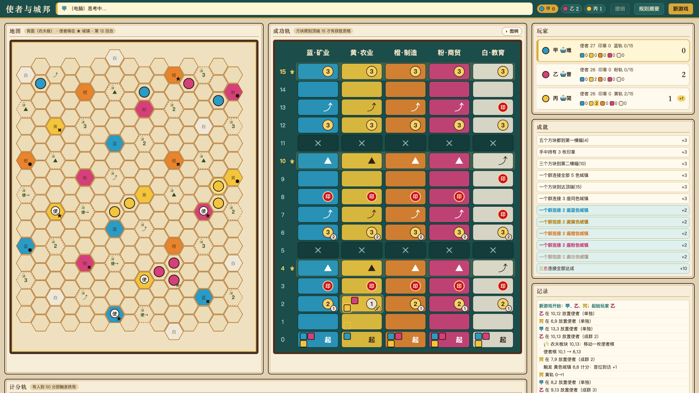

# Cascadero (卡斯卡德罗) — unofficial fan implementation + AI

**[中文说明 → README.zh-CN.md](README.zh-CN.md)**

A hex route-building board game in a single HTML file, plus the complete AI stack that was
built to play it well: a tunable heuristic bot, rollout search, self-play data generation, a
learned value network, and a paired-duel evaluation harness that produced every number in
this README.

The rules are a fan re-implementation of *Cascadero* (Reiner Knizia, Bitewing Games). This
project is unofficial and non-commercial, all art and UI are original, and the AI is the point.
See [Legal notice](#legal-notice) and [NOTICE.md](NOTICE.md).



## What is in the box

| Part | Where | What it does |
|---|---|---|
| Game + engine + AI | `index.html` | Everything runs in the browser: rules engine, three AI levels, animations, undo, local game log. No build step. |
| AI research tooling | `online/*.js`, `online/*.py` | Engine extraction, paired duels, cross-engine duels, simulator differential test, self-play sampling, value-net training, hill-climb tuning, diagnostics. |
| Self-play tuning on a many-core box | `selfplay/` | The hill-climb tuner and validation runs that produced the current heuristic weights (26.7k games). |
| Datasets and models | `data/`, `online/valuenet.json`, GitHub Releases | 32k self-play games as JSONL features, plus the trained value net. |
| Self-hosted private table | `online/server.js` | Invite-only WebSocket server so a few friends can play remotely with the same engine. Not a public service. |

## Quick start

Play locally (single player vs bots, hot-seat 2–4 players):

```bash
python3 serve.py 5235        # then open http://localhost:5235/
# serves only index.html plus the local game-log API; listens on all interfaces so phones on your LAN
# can join a hot-seat game — set CASC_HOST=127.0.0.1 to keep it on this machine
```

The UI is bilingual. It follows the browser language (Chinese for `zh-*`, English otherwise);
the **EN / 中文** button in the header or `?lang=en` / `?lang=zh` overrides that and the choice is
remembered. Game-log lines and server prompts are stored as message keys and rendered by each
client, so players in one online room can each use their own language.

Run the AI tools (Node 18+; tested on Node 22/25):

```bash
cd online
python3 build-engine.py      # extracts the engine from index.html into engine.js (CommonJS)
node simcheck.js 5 back      # differential test: real engine vs the AI's one-step simulator
PAIRED=1 node duel.js 80 '{}' '{"burnP":0}' 3 out.json back   # paired duel: default weights vs an override
```

Train a value net (Python 3 + numpy, `pip install numpy`):

```bash
cd online
gunzip -k ../data/sample-selfplay-91d.jsonl.gz
python3 train.py ../data/sample-selfplay-91d.jsonl --hidden 64 --epochs 30 --winK 14 --out valuenet.json
python3 embed-net.py valuenet.json && python3 build-engine.py   # embed into index.html, regenerate engine.js
```

## The game in one paragraph

2–4 players place envoys on a hex map. An envoy that first connects a group to a town of some
colour scores on that colour's success track (first visitor gets the bigger reward), may pick up
seals, trigger chain advances or extra turns, and the herald piece adds a bonus wherever it
sits. Six unique achievements and five colour-pair achievements pay out once. The first player
to 50 points ends the game, but you only *qualify* to win if the cube of your own colour has
climbed to the top of its track. The back side of the board replaces some fields with farmer
slots holding 24 face-up tiles (2 VP ×5, 3 VP ×5, advance ×5, extra turn ×4, move herald ×5)
that unlock when you build next to them.

Implemented: all core rules and the farmer board. Not implemented: the two-herald advanced
variant and choosing the order when one placement scores several towns.

## AI

### Three levels

| Level | Search | Speed (M-series Mac, back board) |
|---|---|---|
| Easy | one-step greedy on the static evaluation | instant |
| Normal | screen 5 candidates, 1 multi-turn rollout each | ~0.13 s/move |
| Hard | screen 8 candidates, 2 rollouts each, blocking value, exact end-game (`endRoll`), value net as rollout leaf and candidate ranker | ~0.37 s/move |

Measured: Normal beats Easy 77 %, Hard beats Normal 70 % (browser duels, seat-swapped).

### Static evaluation

`simEval()` applies a candidate placement to a cloned state (including seals, chain advances,
achievements and farmer tiles, so it stays consistent with the real engine) and scores it with
about 28 weights in `BOT_TUNE`. Per-board overrides live in `BOT_TUNE_BOARD`, per-player
overrides in `player.tune`, resolved by `tuneOf()`. The weights that matter most, all found by
self-play rather than by hand:

* `sealGainW 4.28`, `chainSealW 5.46` – grabbing seals, especially through chain advances, is the
  strongest signal.
* `firstGiftP 0.73` – penalty for handing an opponent a first-visit reward.
* Back board only: `burnP 1.5`, `openP 0.75`, `nearW 0.25` – a lone envoy touching a town without
  scoring "burns" that town for the group forever (in 16 replayed human games the AI's lone placements did this 232/232 times and 90 % of the
  burned towns never scored; humans did it 106/128 times but 54 of those carried a seal). `farmerNearW 0.6` rewards unlocking farmer
  slots for next turn.
* `heraldW 0` – an explicit herald bonus was harmful once rollouts existed.

### Learned value network

* Features: `stateFeatures(st, pi, rich)` = 76 base + 12 tactical (best/second-best next move
  for me and the opponent, reachable seals, achievable achievement points, number of good
  moves, envoy difference, last-move parity) + 3 action-order + 1 seating = **92 dims**. Older
  models are truncated automatically by `n.features`.
* Model: numpy MLP 92→64→1 ReLU, trained on (feature, final margin) pairs sampled twice per turn
  (mover and best opponent perspective). Objective `margin + 14 × (win ? +1 : −1)` (`--winK 14`)
  so the qualification rule is learned.
* Used in two places, both switchable per player: `useNet` replaces the rollout leaf value,
  `netRankW` adds the net's opinion when screening candidates (only the top 40 by static score
  are evaluated, ~0.4 s/move).
* Training and inference share one feature function because `engine.js` is generated from
  `index.html`. The weights are embedded as `VALUE_NET` in the page and kept in
  `online/valuenet.json`.

Validation R² on held-out games: hand-written potential 0.29 → 76-dim linear 0.43 → rich
features 0.52. Adding non-linearity or more data barely moved it: **features are the bottleneck,
not data volume.**

### Pipeline

```
index.html ──build-engine.py──▶ engine.js ──selfplay.js──▶ samples.jsonl ──train.py──▶ valuenet.json
     ▲                                                                                     │
     └──────────────────────────── embed-net.py ◀──────────────────────────────────────────┘
```

Evaluation loop: `duel.js` (paired) / `xduel.js` (two engines) / `simcheck.js` (simulator vs
engine) / `tune.js` (hill-climb) / `diag-stuck.js` (targeted diagnostics).

### Evaluation methodology (the part worth stealing)

* **Paired duels** (`PAIRED=1`): every pair of games shares the farmer-tile layout, first player,
  board and herald; A and B swap seats. Report the mean of paired margin sums ± SE and the
  paired win count. 40 pairs give an SE of about 2.4 points, roughly half the sample a plain win
  count needs. Colour, herald and first-player rotate independently (`pairIdx % 6`, `/6 % 3`,
  `/18 % 2`).
* **Acceptance**: screen with 36–72 pairs, confirm with an independent 100–400 pair run. Win rate
  is the primary metric; margin is secondary because qualification-type changes trade points
  for wins.
* **Always run an A/A control.** Ours came out 35:37, +1.3 ± 1.9, which is how we know the harness
  is unbiased.
* **Differential-test the simulator.** `simcheck.js` plays games with the real engine and checks
  that `simEval()` predicts the identical state after every placement. Two independent reviews
  found ten simulator/engine mismatches; fixing them (no model change) was the single largest
  gain in the project.

### Results timeline (Hard level, back board unless noted)

| Change | Test | Result |
|---|---|---|
| Self-play hill-climb of heuristic weights (`selfplay/tuner.py`, 26.7k games) | 200 games vs old defaults | 64.5 % |
| Town-burn penalty (`burnP/openP/nearW`) | 200 games seat-swapped | 77.5 %, +10.2 pts/game |
| `farmerNearW 0.6` | 100 pairs | +9.45 ± 1.44, 76/100 pairs |
| Value net as rollout leaf (76-dim) | 100 pairs | +5.7 ± 1.2, 66/100 |
| Value net in candidate ranking (`netRankW`) | 100 pairs | +8.1 ± 1.4, 69/100 |
| Rich features (88-dim) | 100 pairs | +10.5 ± 1.4, 74/100 |
| Win-aware objective (`--winK 14`) | 100 pairs | own-track-top rate 56 % → 82 %; "led on points but not qualified" losses 19 → 2; 61.5 % wins, margin +0.2 (neutral) |
| Simulator consistency fixes, same model | 40 pairs, `xduel.js` | **73.8 %, +20.3 ± 2.1** |
| Second round of engine fixes (turn state in rollouts, tie-break, achievement scan after moves) | 40 pairs | 60 %, +2.9 ± 2.0 |
| Current build vs the build before the simulator fixes | 40 pairs | 87.5 %, +23.5 ± 2.1, 38/40 |
| 4× rollout budget (`rollN 6, topK 14`) vs current | 40 pairs | 75 %, +6.0 ± 1.8 → search still has headroom |
| Multiplayer sanity: new vs old | 3-player 13/13 groups, 4-player 20/20 groups | all won |

Front board: the town-burn penalties are *negative* there (36 towns on 198 fields, 95 % of
fields touch a town, so towns are not scarce); the front board keeps the plain weights.

### What did not work (kept in code, default off)

* `achW` achievement-proximity bonus: 0.2/0.5/1/2 → 44/39/39/34 % monotonically worse.
* `advReply` adversarial first reply inside rollouts: +0.3 to +3.7 ± 2.4 for +40 % time.
* `endExact` minimax/paranoid end-game: −0.7 to −4.3 ± 2.0. The real opponent is greedy, and random
  rollouts model it better than worst-case assumptions.
* `cubeLook` never triggers: on both boards no field touches two towns, verified by geometry.
* `netFinalW`, `netSearchW` (net as 2-ply adversarial search): ≤ +1.8.
* Retraining on the same features (v3), bigger `rollN/topK` alone, 94 hill-climb candidates after
  the net was in: 0 accepted.
* Static bonuses for escaping "stuck at 10 under the barrier" (`stuckTakeW/stuckPlanW`): they
  move the trade-off between qualification and points but do not raise the win rate.
* `qualLeafW`, `winK 8`, `winK 20`, retraining on post-fix data (`+2.3 ± 1.2`, 1.9σ, not accepted).

### Lessons

1. ≤16 games is noise. Use ≥40–50 games with seat swap, or paired duels. First-player/colour
   bias alone is about 60 %.
2. Hand-written "obviously correct" evaluation terms were net negative more often than not.
3. Fix the simulator before tuning the search. Every "search does not help" conclusion before
   the consistency fix was measured on a biased simulator and had to be redone.
4. The training target must encode the win condition, not just the score margin. Watch win rate,
   not margin, for qualification-type changes.
5. Features beat data volume; nonlinearity added little.
6. Constant features have std = 0 → NaN after normalisation → random candidate order. Guard it
   (`train.py` floors std, `valueNet()` falls back).
7. In A/B tests each side needs its own model (`tune.net`); a global override makes both sides
   identical and the test meaningless.
8. Hill-climb acceptance at 29/50 wins has ~16 % false accepts; harvest with 200-game validation
   of several candidates instead of trusting the walk.
9. Before adding a heuristic for a scenario, confirm the scenario exists (replay or geometry).

### Roadmap

1. Unified referee, cross-engine schedule with recorded seeds/versions, a minimal opponent pool
   and a human-game regression set (so defensive play becomes measurable).
2. Diagnostics: candidate omissions on 120 frozen positions, secondary decisions (cube choice,
   envoy move, herald move) on 100–200 decision points, micro end-games on 50–100 positions.
3. Sequential Halving at the root under equal budget (8 candidates × 48 continuations as
   8×2→4×4→2×8 vs 8×6), then searching the secondary decisions.
4. Multi-head value (P(win), qualification, margin) and move-ranking labels on 300–500 positions.
5. The same pipeline for the front board (expected +5–8 points).
6. Multiplayer representation: describe all seats and each seat's win probability.

## Datasets and models

Self-play samples are JSONL, one row per (turn, perspective):
`{"f": [features], "y": final margin, "w": win flag, "q"/"qo": own/opponent qualified, "t": turn, "g": game index, "tot": total turns}`.

| Asset | Games | Rows | Dims | Generated by |
|---|---|---|---|---|
| `data/sample-selfplay-91d.jsonl.gz` (in repo) | 300 | 35k | 91 | fixed-simulator engine, one worker |
| `selfplay-76d-basic-15657games.tar.gz` (Release) | 15,657 | 1.86M | 76 | base heuristic bot and first net |
| `selfplay-88d-rich-5400games.tar.gz` (Release) | 5,400 | 642k | 88 | full bot, rich features |
| `selfplay-88d-rich-qual-5400games.tar.gz` (Release) | 5,400 | 642k | 88 + q/qo | full bot, qualification flags |
| `selfplay-91d-simfix-5400games.tar.gz` (Release) | 5,400 | 637k | 91 + q/qo | after simulator fixes |
| `online/valuenet.json` | – | – | 88 (the engine truncates its 92-dim features to fit) | the deployed model (`mix14`, win-aware objective) |

Datasets from the biased simulator are still useful: the deployed model was trained on them and
survived the fix, which is itself a data point (the model is insensitive to the bias; the search
was not).

## Self-hosted private table

`online/server.js` lets a handful of friends play the same engine remotely. It is designed to
be **private by construction**, not a public game site:

* No open registration and no lobby. Creating a room needs an owner passphrase; joining needs a
  room code plus pairing code (an invite link carries both). Wrong guesses lock the IP for a
  minute after five attempts.
* `CASC_MAX_ROOMS` (default 8) caps concurrent rooms. Rooms idle for 7 days are deleted.
* The Docker Compose file binds to `127.0.0.1` only; put your own HTTPS reverse proxy (with
  WebSocket forwarding) in front if you want remote friends.
* Server-authoritative rules: clients send decisions, the server validates and broadcasts full
  state (including animation events). Bot seats run on the server. Undo requires consent from
  every other human, with a 120 s timeout.
* Data kept: `rooms.json` (state snapshots, ≤24 per room), `gamelog.jsonl` only for games with
  at least one human (nicknames as typed, no accounts, file capped at 50 MB), a 30-day HMAC auth
  cookie, and an in-memory IP failure counter. Nothing leaves the machine.
* Hardening: per-connection message rate limit, connection cap (`CASC_MAX_CONN`, default 64),
  strict auth-token format checks, top-level error boundaries so a malformed request or an
  oversized frame only drops that request or connection. Behind a reverse proxy you control, set
  `CASC_TRUST_PROXY=1` so lockouts use the last `X-Forwarded-For` hop; never set it when the
  container is reachable directly.

```bash
cp .env.example .env                 # set CASC_OWNER_PIN / CASC_SITE_PIN (4–32 chars, not the sample values)
python3 online/build-engine.py
docker compose up -d --build         # http://127.0.0.1:5235/  (Dockerfile and compose file are at the repo root)
# or without Docker:
cd online && npm ci --omit=dev && CASC_OWNER_PIN=x CASC_SITE_PIN=y PORT=5321 node server.js
```

`online/deploy.example.sh` shows a tar-over-ssh deploy to a NAS. `online/e2e.py` is a Playwright
regression (gate → create room → invite link → play → consented undo → reconnect → bad link);
install with `pip install playwright && playwright install chromium`, then run it with `PIN` and
`SITE` set to the same values as `CASC_OWNER_PIN` and `CASC_SITE_PIN` of the server under test.

The author only supports private self-hosting and will not help with public deployments. That is a
statement of intended use, not an extra license term; a public service would also raise the rights
questions in NOTICE.md.

## Repository layout

```
index.html              game + engine + AI (single file, English / 中文 UI)
serve.py                local static server + /api/gamelog
Dockerfile, .dockerignore, docker-compose.yml, .env.example   table packaging (build context = repo root)
online/
  build-engine.py       index.html → engine.js
  server.js             private table server (ws)
  deploy.example.sh     tar-over-ssh deploy to a Docker host
  e2e.py                Playwright regression for the table
  duel.js               paired duels between weight sets / models
  xduel.js              paired duels between two engine builds
  simcheck.js           engine vs simulator differential test
  selfplay.js           self-play sample generator
  train.py              value-net trainer (numpy)
  embed-net.py          embed weights into index.html
  tune.js               hill-climb tuner with screen/validate gates
  diag-stuck.js         "stuck under the barrier" diagnostic
  valuenet.json         deployed model
  tune-back/            tuning log and anchor state from the last run
selfplay/               many-core hill-climb (tuner.py/validate.py, match.js game CLI) and its logs
data/                   sample dataset
docs/                   screenshots
```

## Legal notice

This is an unofficial, non-commercial fan implementation made for personal study and AI
research. The game design, rules and terminology belong to their designer and publisher; the two
board layouts were transcribed by hand from the published game so the AI could train on real
maps. No artwork from the published game is used. The MIT license covers the code, the models
and the datasets only; it grants nothing regarding the game design. Details, and how to request
changes or removal, are in [NOTICE.md](NOTICE.md). Please buy the physical game.
