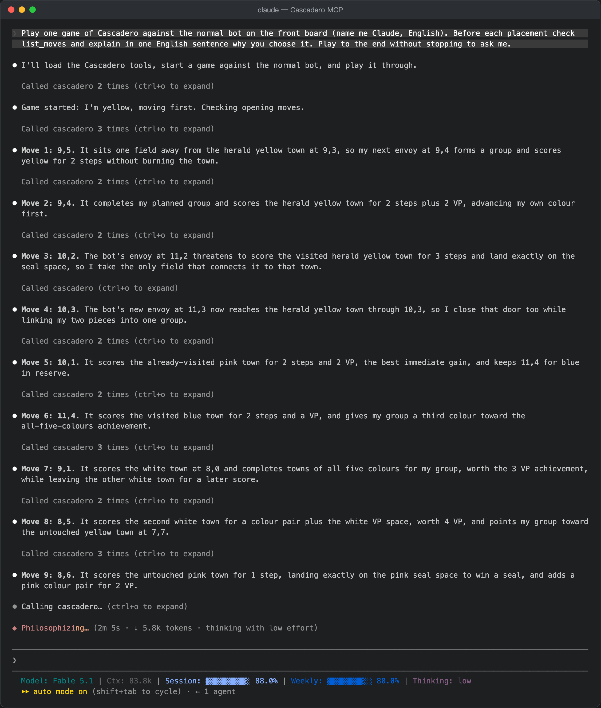
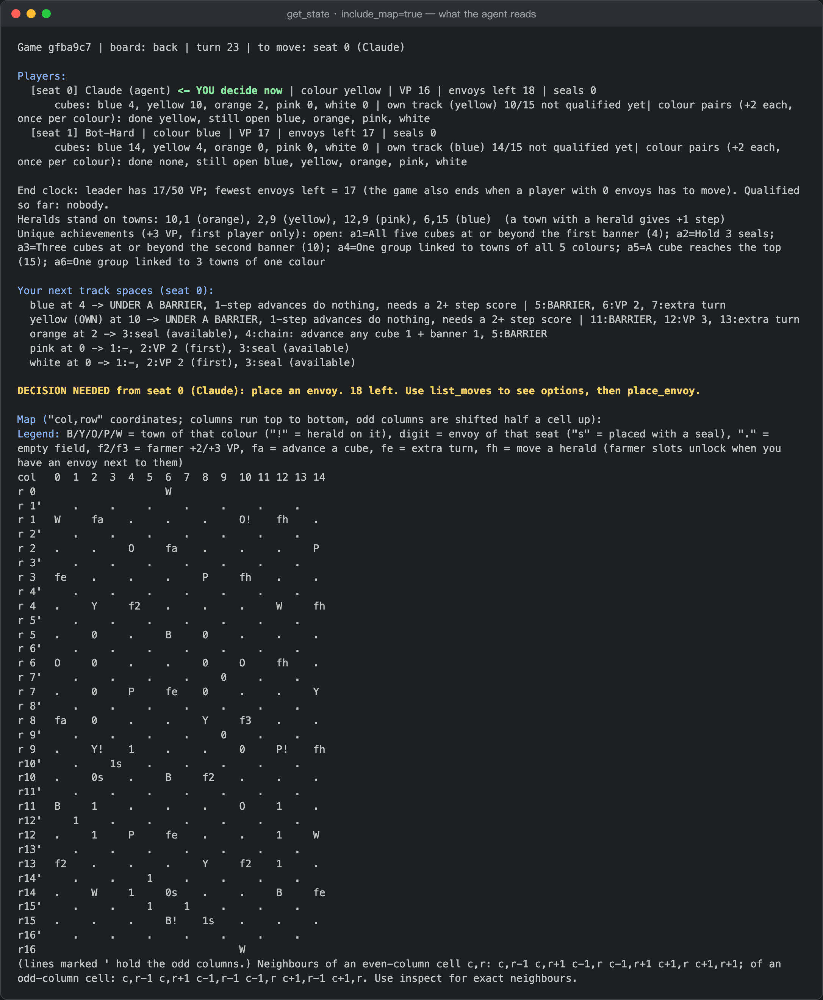

# Cascadero MCP

**Let an AI agent play the board game Cascadero.** `cascadero-mcp` is a [Model Context Protocol](https://modelcontextprotocol.io) server that connects any MCP-compatible client — Claude Code, Claude Desktop, Cursor, Codex CLI, … — to a complete rules engine of Reiner Knizia's *Cascadero* and its built-in bots. Everything happens through text tool calls: no screen capture, no vision model.

   

[中文说明](README.zh-CN.md) · part of the [cascadero](..) repository (browser game, AI research tooling, private table server)



## Features

- **Complete games**, 2–4 seats, front board or the back board with farmer tiles; any seat can be the agent or a bot (easy / normal / hard). Several agent seats let one model play both sides or two models share a table.
- **Exact information instead of pixels.** The position comes as text: player summary, ASCII hex map, your next track spaces, and for every legal placement the *exact* outcome under the real rules — cube steps, VP itemised by source, seals, extra turns, whether it ends the game.
- **Four decision kinds**, the same ones the rules ask a human: place an envoy, advance a cube (chain), move an envoy (seal already taken), move a herald (farmer tile).
- **Every answer is validated by the engine.** Illegal answers come back as tool errors that say why — occupied field, locked farmer slot, a seal that would do nothing there, a cube stuck under a barrier, wrong kind of decision — and change nothing.
- **Ask the built-in bot** for its choice, **undo** your last placement, resume **saved games**, and store **post-game notes** that are fed back to the agent next time.
- **Rules digest and strategy handbook** (English / Chinese) as a tool, as resources and as a ready-made prompt.

## Requirements

- Node.js 20 or newer
- Python 3 — only to generate `online/engine.js` from `index.html` (the server does it on first start when the file is missing; `npm run build` does it by hand)

## Install

### 1. Get the code

```bash
git clone https://github.com/wenjiavv/cascadero.git
cd cascadero/mcp
npm install
npm run build        # generates ../online/engine.js (needs python3)
```

### 2. Connect your client

**Claude Code**

```bash
claude mcp add cascadero -- node /ABSOLUTE/PATH/cascadero/mcp/src/index.mjs
```

**Claude Desktop** (`claude_desktop_config.json`), **Cursor** (`.cursor/mcp.json`) and other JSON-configured clients:

```json
{
  "mcpServers": {
    "cascadero": {
      "command": "node",
      "args": ["/ABSOLUTE/PATH/cascadero/mcp/src/index.mjs"]
    }
  }
}
```

**Codex CLI** (`~/.codex/config.toml`):

```toml
[mcp_servers.cascadero]
command = "node"
args = ["/ABSOLUTE/PATH/cascadero/mcp/src/index.mjs"]
```

Add `"env": { "CASC_MCP_LANG": "zh" }` (or `-e CASC_MCP_LANG=zh` for Claude Code) if you want the game log and handbook in Chinese.

### 3. Start playing

Tell the agent something like:

> Play a game of Cascadero against the normal bot. Read the handbook first, explain each move in one sentence, and play to the end.

or use the bundled prompt `cascadero_play` (arguments: `opponent`, `board`, `lang`). The agent will call `new_game`, loop over `list_moves` → `place_envoy` (plus the occasional `choose_track` / `move_envoy` / `move_herald`), and get the opponents' replies and its next decision back from every call.

## What the agent sees

`get_state` with `include_map=true` — the whole position as text, including the ASCII hex map:



`list_moves` in the middle of a game:

```text
Legal placements for seat 0 (Claude): 182 fields; 137 options have an immediate effect (cube steps, VP, seal, extra turn or farmer tile), 200 are quiet.
Showing moves with an immediate effect, best 5 by the engine's one-move heuristic h (a rough guide that ignores your long-term plan):
  0,3 +SEAL | lone envoy | towns: 1,4 yellow+herald SCORES 3 | result: cubes yellow+3, VP +3 (yellow track 6: 3), seals: 1 spent, extra turn +1 | h=9.9
  0,4 +SEAL | lone envoy | towns: 1,4 yellow+herald SCORES 3 | result: cubes yellow+3, VP +3 (yellow track 6: 3), seals: 1 spent, extra turn +1 | h=9.9
  1,5 +SEAL | lone envoy | towns: 1,4 yellow+herald SCORES 3 | result: cubes yellow+3, VP +3 (yellow track 6: 3), seals: 1 spent, extra turn +1 | h=9.9
```

The reply to a `place_envoy` call — consequences, the opponent's turn, the next decision:

```text
Placed an envoy at 14,13.
Events:
  Claude places an envoy at 14,13 with a seal ◉
  　orange town 13,13: advance 2 spaces (visited before) + 1 (herald)
  Claude: orange track 3→6
Score: [0] Claude 5 VP, own 4/15, envoys 21, seals 1 | [1] Bot-Normal 6 VP, own 0/15, envoys 22, seals 0 | turn 17

DECISION NEEDED from seat 0 (Claude): orange track 4: advance any cube 1 space
  Options: blue 3->4 [chain: advance any cube 1 + banner 1] WARNING: then stuck under the barrier until a 2+ step score on this colour | yellow 4->blocked by barrier, unavailable | orange 6->7 [extra turn] | pink 0->1 [empty] | white 0->1 [empty]
  Call choose_track with a track colour (or skip).
```

## Tools

| Tool | What it does |
|---|---|
| `new_game` | Start a game: `seats` (`agent` / `easy` / `normal` / `hard`, 2–4, table order), `board` (`front` / `back`), `first`, `colors`, `herald`, `agent_name`, `lang`, `allow_undo`. Returns the opening position, the map and the first decision. |
| `get_state` | Full position: players, cubes, seals, heralds, achievements, end clock, your next track spaces, what happened since your last call, the pending decision. `include_map` adds the ASCII hex map. |
| `list_moves` | Legal placements with exact facts. `filter` = `scoring` (moves with an immediate effect, default) / `setup` (quiet moves and what they prepare) / `all`; `near` = a town or field to zoom in on; `limit`. |
| `inspect` | Exact neighbourhood of a town or field: colour, herald, visited or not, who stands where; for an envoy, its group and the towns that group cannot score right now. |
| `place_envoy` | The main move: `field` (`"col,row"`), optional `use_seal`. |
| `choose_track` | Answer an "advance any cube 1 space" decision (chain space or farmer tile): `color`, or `skip`. |
| `move_envoy` | Answer "the seal is gone, you may move an envoy": `from`, `to`, or `skip`. |
| `move_herald` | Answer a farmer tile's "move a herald": `from`, `to`, or `skip`. |
| `engine_advice` | What the built-in bot (`normal` / `hard`) would answer to the pending decision, with the facts of its pick. |
| `undo` | Take back your last placement (or, mid-placement, restart it). The bots replay their turns. |
| `list_games` | Saved games on disk. Pass an id as `game_id` to any tool to resume an unfinished one. |
| `get_rules` | `handbook` (rules digest + tool guide + strategy + saved lessons), `tracks` (every space of the five tracks), `board_front`, `board_back`. |
| `save_postgame_notes` | Store a short post-game analysis. The latest notes are quoted in the handbook and attached to the play prompt as reference material. |

Every action tool returns what happened, the opponents' replies and the next decision, so an agent plays a whole game as a plain loop of *look → decide → act*. Tool calls are executed one at a time.

## Resources and prompt

| Resource | Content |
|---|---|
| `cascadero://handbook`, `cascadero://handbook/zh` | Rules digest, tool guide, strategy, saved lessons |
| `cascadero://tracks` | The five success tracks, space by space |
| `cascadero://board/front`, `cascadero://board/back` | Towns by colour and the empty map |
| `cascadero://postgame/{name}` | Individual post-game notes |

Prompt `cascadero_play` (`opponent`, `board`, `lang`): the handbook plus the instruction to play one full game; saved lessons travel as an attached resource, separate from the instruction text.

## Configuration

| Environment variable | Meaning |
|---|---|
| `CASC_MCP_DATA` | Where games, the game log and post-game notes are stored (default `~/.cascadero-mcp`) |
| `CASC_MCP_LANG` | `en` (default) or `zh`: language of game-log lines and of the handbook |
| `CASC_ENGINE` | Path to an `engine.js` to use instead of `../online/engine.js` |

## How it works

```text
MCP client (Claude Code / Claude Desktop / Cursor / Codex CLI / …)
        │  stdio, MCP tool calls
        ▼
src/index.mjs   tools, resources, prompt
src/game.mjs    turn loop: parks on a pending decision for agent seats, validates the answer, resumes;
                undo; saves every turn to disk
src/view.mjs    position → text: summary, ASCII hex map, exact move facts, inspection, log lines
        │  require()
        ▼
../online/engine.js   rules engine + the three bot levels (generated from ../index.html)
```

The engine's turn loop asks a `decide` object for the four decision kinds. For agent seats that object parks the promise on the game's *pending* decision until a tool call answers it; bot seats answer from the engine's own search. The "result" shown by `list_moves` comes from running the real turn on a copy of the position (chain advances answered by a simple rule, optional moves skipped), so achievements and colour pairs that are already claimed are never promised again; the quick evaluator is only used for sorting.

Finished games are appended to `gamelog.jsonl` in the same shape as the table server's log (opening snapshot + decision list, `tag:"end"`). An undo after the end adds a `tag:"undo"` record; a new finish adds another `end` with a higher `rev`. The last record per `id` is the valid one.

## Development

```bash
npm test         # scripted client plays three complete games over the real protocol:
                 # illegal answers, undo, post-game notes, resuming after a restart
npm run fuzz     # random legal and junk answers, skips and undos at the session layer
```

The code was reviewed in three rounds by an external model in read-only mode; the notes are in `docs/`.

## Limitations

- stdio transport only; one tool call at a time (the engine keeps the active board in module state).
- The two-herald advanced variant and choosing the scoring order when one placement touches several towns are not implemented (same as the browser game).
- An agent's strength is the agent's own business: the built-in *hard* bot searches a few turns ahead and was tuned on ~27k self-play games, so expect to lose to it at first.

## License and notice

MIT for the code. Cascadero is a board game by Reiner Knizia; this is an unofficial, non-commercial fan implementation — see the repository's [NOTICE.md](../NOTICE.md).
