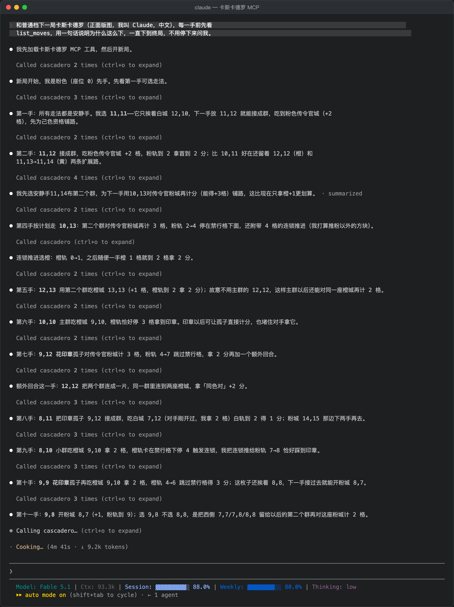

# 卡斯卡德罗 MCP

**让 AI 自己来下桌游《卡斯卡德罗》。** `cascadero-mcp` 是一个 [Model Context Protocol](https://modelcontextprotocol.io) 服务，把 Claude Code、Claude Desktop、Cursor、Codex CLI 等任何支持 MCP 的客户端接到 Reiner Knizia《Cascadero》的完整规则引擎和内置电脑上。全程只靠文字工具调用：不截屏、不用视觉模型。

   

[English](README.md) · 属于 [cascadero](..) 仓库（网页版游戏、AI 研究工具、私人联机牌桌）



## 特性

- **完整对局**，2–4 个座位，正面版图或带农夫板块的背面版图；每个座位可以是 AI（agent）或内置电脑（简单 / 普通 / 困难）。多个 agent 座位可以让一个模型左右互搏，或两个模型同桌。
- **精确信息，而不是像素。** 局面以文字给出：玩家摘要、字符六边形地图、你各条轨道接下来的格子，以及每个合法落点按**真实规则**算出的结果——推几格、得分及来源明细、印章、额外回合、是否终局。
- **四种决策**，和规则问真人的一样：放使者、推进方块（连锁）、移动使者（印章已被拿走）、移动使者棋（农夫板块）。
- **每个答复都经引擎校验。** 不合法的答复以工具错误返回并说明原因——格子已被占、农夫格未解锁、此处用印章无效、方块被禁行格挡住、决策类型不对——局面不变。
- **问内置电脑**它会怎么走，**撤销**上一手，**续下存档**，**记赛后笔记**（下次会回灌给 AI）。
- **规则摘要与策略手册**（中 / 英），以工具、资料和现成提示词三种形式提供。

## 环境要求

- Node.js 20 或更新
- Python 3——只用来从 `index.html` 生成 `online/engine.js`（文件缺失时服务首次启动会自动生成；`npm run build` 手动生成）

## 安装

### 1. 取代码

```bash
git clone https://github.com/wenjiavv/cascadero.git
cd cascadero/mcp
npm install
npm run build        # 生成 ../online/engine.js（需要 python3）
```

### 2. 接到你的客户端

**Claude Code**

```bash
claude mcp add cascadero -e CASC_MCP_LANG=zh -- node /绝对路径/cascadero/mcp/src/index.mjs
```

**Claude Desktop**（`claude_desktop_config.json`）、**Cursor**（`.cursor/mcp.json`）等 JSON 配置的客户端：

```json
{
  "mcpServers": {
    "cascadero": {
      "command": "node",
      "args": ["/绝对路径/cascadero/mcp/src/index.mjs"],
      "env": { "CASC_MCP_LANG": "zh" }
    }
  }
}
```

**Codex CLI**（`~/.codex/config.toml`）：

```toml
[mcp_servers.cascadero]
command = "node"
args = ["/绝对路径/cascadero/mcp/src/index.mjs"]
env = { CASC_MCP_LANG = "zh" }
```

`CASC_MCP_LANG=zh` 让对局日志和手册用中文；不设则是英文。

### 3. 开始下

对 AI 说一句：

> 和普通档下一局卡斯卡德罗。先读手册，每一手用一句话说明理由，一直下到终局。

或者用自带的提示词 `cascadero_play`（参数 `opponent`、`board`、`lang`）。AI 会调 `new_game`，然后循环 `list_moves` → `place_envoy`（偶尔穿插 `choose_track` / `move_envoy` / `move_herald`），每次调用都拿回对手的应对和下一个决策。

## AI 看到的是什么

`get_state` 加 `include_map=true`——整个局面都是文字，包括字符六边形地图：


中盘的一次 `list_moves`：

```text
Legal placements for seat 0 (Claude): 182 fields; 137 options have an immediate effect (cube steps, VP, seal, extra turn or farmer tile), 200 are quiet.
Showing moves with an immediate effect, best 5 by the engine's one-move heuristic h (a rough guide that ignores your long-term plan):
  0,3 +SEAL | lone envoy | towns: 1,4 yellow+herald SCORES 3 | result: cubes yellow+3, VP +3 (yellow track 6: 3), seals: 1 spent, extra turn +1 | h=9.9
  0,4 +SEAL | lone envoy | towns: 1,4 yellow+herald SCORES 3 | result: cubes yellow+3, VP +3 (yellow track 6: 3), seals: 1 spent, extra turn +1 | h=9.9
  1,5 +SEAL | lone envoy | towns: 1,4 yellow+herald SCORES 3 | result: cubes yellow+3, VP +3 (yellow track 6: 3), seals: 1 spent, extra turn +1 | h=9.9
```

一次 `place_envoy` 的返回——后果、对手那一手、下一个决策：

```text
Placed an envoy at 14,13.
Events:
  Claude places an envoy at 14,13 with a seal ◉
  　orange town 13,13: advance 2 spaces (visited before) + 1 (herald)
  Claude: orange track 3→6
Score: [0] Claude 5 VP, own 4/15, envoys 21, seals 1 | [1] Bot-Normal 6 VP, own 0/15, envoys 22, seals 0 | turn 17

DECISION NEEDED from seat 0 (Claude): orange track 4: advance any cube 1 space
  Options: blue 3->4 [chain: advance any cube 1 + banner 1] WARNING: then stuck under the barrier until a 2+ step score on this colour | yellow 4->blocked by barrier, unavailable | orange 6->7 [extra turn] | pink 0->1 [empty] | white 0->1 [empty]
  Call choose_track with a track colour (or skip).
```

（示例为英文日志；`CASC_MCP_LANG=zh` 时事件行和决策说明是中文。）

## 工具

| 工具 | 作用 |
|---|---|
| `new_game` | 开局：`seats`（`agent` / `easy` / `normal` / `hard`，2–4 个，按座位顺序）、`board`（`front` / `back`）、`first`、`colors`、`herald`、`agent_name`、`lang`、`allow_undo`。返回开局局面、地图和第一个决策。 |
| `get_state` | 完整局面：玩家、方块、印章、使者棋、成就、终局时钟、你各条轨道接下来的格子、上次调用以来发生了什么、正在等的决策。`include_map` 附字符地图。 |
| `list_moves` | 合法落点及精确事实。`filter` = `scoring`（有即时效果的，默认）/ `setup`（安静着法及其铺垫）/ `all`；`near` = 只看某城或某格周围；`limit`。 |
| `inspect` | 某城 / 某格的精确邻接：颜色、使者棋、是否被访问过、每个相邻格站着谁；格上有使者时给出它的群和这个群此刻不能计分的城镇。 |
| `place_envoy` | 主动作：`field`（`"列,行"`），可选 `use_seal`。 |
| `choose_track` | 回答「任选一个方块推 1 格」（连锁格或农夫板块）：`color`，或 `skip`。 |
| `move_envoy` | 回答「印章已被拿走，可移动一枚使者」：`from`、`to`，或 `skip`。 |
| `move_herald` | 回答农夫板块的「移动使者棋」：`from`、`to`，或 `skip`。 |
| `engine_advice` | 内置电脑（`normal` / `hard`）对当前决策会怎么答，附它所选落点的事实。 |
| `undo` | 撤回自己上一手（落子中途则回到这一手开始前），电脑重新应对。 |
| `list_games` | 磁盘上的存档；把 id 作为 `game_id` 传给任意工具即可续下未完成的局。 |
| `get_rules` | `handbook`（规则摘要 + 工具用法 + 策略 + 以前记下的教训）、`tracks`（五条轨道逐格）、`board_front`、`board_back`。 |
| `save_postgame_notes` | 记一段赛后分析。最近几条会以引用形式附在手册后面，并作为参考资料附在提示词里。 |

每个动作工具都会返回后果、对手的应对和下一个决策，AI 只需要循环「看 → 想 → 做」。工具调用串行执行。

## 资料与提示词

| 资料 | 内容 |
|---|---|
| `cascadero://handbook`、`cascadero://handbook/zh` | 规则摘要、工具用法、策略、以前记下的教训 |
| `cascadero://tracks` | 五条成功轨逐格说明 |
| `cascadero://board/front`、`cascadero://board/back` | 各色城镇坐标和空地图 |
| `cascadero://postgame/{name}` | 单条赛后笔记 |

提示词 `cascadero_play`（`opponent`、`board`、`lang`）：手册 + 「完整下一局」的指令；以前记下的教训作为附带的资料单独给出，不混进指令正文。

## 配置

| 环境变量 | 含义 |
|---|---|
| `CASC_MCP_DATA` | 对局存档、对局记录、赛后笔记的目录（默认 `~/.cascadero-mcp`） |
| `CASC_MCP_LANG` | `en`（默认）或 `zh`：对局日志和手册的语言 |
| `CASC_ENGINE` | 指定另一份 `engine.js` |

## 原理

```text
MCP 客户端（Claude Code / Claude Desktop / Cursor / Codex CLI / …）
        │  stdio，MCP 工具调用
        ▼
src/index.mjs   工具、资料、提示词
src/game.mjs    回合循环：agent 座位停在「待决策」上等工具调用来答复，校验后继续；撤销；每回合落盘
src/view.mjs    局面 → 文字：摘要、字符六边形地图、精确落点事实、格子查询、日志行
        │  require()
        ▼
../online/engine.js   规则引擎 + 三档电脑（由 ../index.html 生成）
```

引擎的回合循环通过一个 `decide` 对象问四种决策。agent 座位的 `decide` 把 Promise 挂在对局的「待决策」上，直到某个工具调用来答复；电脑座位由引擎自己的搜索回答。`list_moves` 里的「结果」是在局面副本上跑一遍真实回合得到的（连锁推进按简单规则代答，可选的移动跳过），所以已经拿过的成就、同色对不会再被算进去；快速估值只用来排序。

下完的对局追加到 `gamelog.jsonl`，格式与联机牌桌的对局记录一致（开局快照 + 决策序列，`tag:"end"`）。终局后撤销会追加一条 `tag:"undo"`，再次下完追加新的 `end` 且 `rev` 加一；同一 `id` 以最后一条为准。

## 开发

```bash
npm test         # 脚本化客户端走真实协议下三整局：非法答复、撤销、赛后笔记、重启续局
npm run fuzz     # 会话层随机乱下：随机合法答复、乱答、放弃、撤销
```

代码由外部模型以只读方式审过三轮，意见原文在 `docs/`。

## 限制

- 只有 stdio 传输；工具调用串行（引擎的当前版图是模块级状态）。
- 与网页版一样，未实现「两枚使者棋」高级变体，以及一次落子触发多座城镇时自选计分顺序。
- AI 下得好不好是 AI 自己的事：内置的「困难」档会往前推演几回合，参数来自约 2.7 万局自对弈调参，一开始输给它很正常。

## 许可与声明

代码 MIT。《卡斯卡德罗》是 Reiner Knizia 设计的桌游，本项目是非官方、非商用的爱好者实现——见仓库 [NOTICE.md](../NOTICE.md)。
